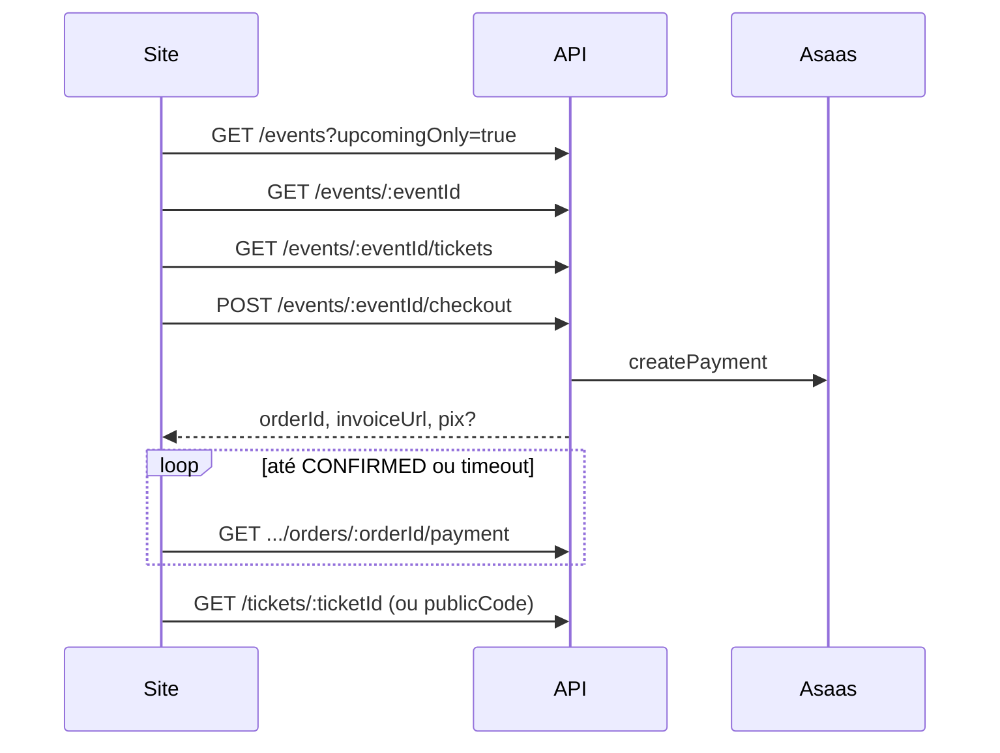

# API Reference — Eventos (site público)

Referência para o **frontend do site** (Next.js ou outro). Todas as rotas abaixo estão **implementadas** na API Nest.

| Item | Valor |
|------|--------|
| Prefixo global | `/api` |
| Base | `{API_ORIGIN}/api` (ex.: `https://api.igreja.exemplo/api`) |
| Tenant | `:slug` na URL — sem JWT |
| Content-Type | `application/json` em `POST` com corpo |
| CORS | O **origin** do site tem de estar registado em `tenant_public_web_origins` (painel admin → Configurações) |

Documento de visão/alvo histórico (campos futuros): [events-public-contract.md](./events-public-contract.md).

---

## Índice

1. [Fluxo recomendado no site](#1-fluxo-recomendado-no-site)
2. [Tipos TypeScript (copiar para o front)](#2-tipos-typescript-copiar-para-o-front)
3. [Listar eventos](#3-listar-eventos)
4. [Detalhe do evento](#4-detalhe-do-evento)
5. [Tipos de ingresso](#5-tipos-de-ingresso)
5.1. [Ingresso por id (inclui privados)](#51-ingresso-por-id-inclui-privados)
6. [Checkout (pagamento)](#6-checkout-pagamento)
7. [Polling do pagamento](#7-polling-do-pagamento)
8. [Bilhete pós-compra](#8-bilhete-pós-compra)
9. [Inscrição gratuita](#9-inscrição-gratuita)
10. [Inscrições do participante](#10-inscrições-do-participante)
11. [Escalas (horários fixos)](#11-escalas-horários-fixos)
12. [Erros e códigos HTTP](#12-erros-e-códigos-http)
13. [Notas de implementação no front](#13-notas-de-implementação-no-front)

---

## 1. Fluxo recomendado no site

### Evento com ingressos pagos



### Evento só com inscrição gratuita

1. `GET /events/:eventId`
2. `GET /events/:eventId/registrations/check?email=...` (opcional)
3. `POST /events/:eventId/registrations`

---

## 2. Tipos TypeScript (copiar para o front)

```typescript
export interface PublicEventTagDto {
  id: string;
  name: string;
  slug: string;
}

/** Resposta padrão de evento (listagem e detalhe). */
export interface PublicEventDto {
  id: string;
  title: string;
  description: string | null;
  format: 'IN_PERSON' | 'ONLINE' | 'HYBRID';
  onlineUrl: string | null;
  shortDescription: string | null;
  detailsHtml: string | null;
  videoUrl: string | null;
  coverImageUrl: string | null;
  mediaMeta: any | null;
  /** YYYY-MM-DD (UTC, campo @db.Date). */
  date: string;
  /** HH:MM:SS ou null. */
  timeStart: string | null;
  timeEnd: string | null;
  location: string | null;
  imageUrl: string | null;
  tag: string | null;
  tags: PublicEventTagDto[];
  published: boolean;
  slug: string | null;
  timezone: string | null;
  registrationClosesAt: string | null;
  termsUrl: string | null;
  currency: string | null;
  createdAt: string;
  updatedAt: string;
}

export interface PublicEventListResponse {
  items: PublicEventDto[];
  /** Sempre null hoje — paginação cursor ainda não implementada. */
  nextCursor: string | null;
}

export interface PublicTicketFieldDto {
  fieldId: string;
  key: string;
  label: string;
  type: 'TEXT' | 'EMAIL' | 'PHONE' | 'CPF' | 'TEXTAREA' | 'SELECT' | 'CHECKBOX';
  options: string[] | null;
  required: boolean;
}

export interface PublicTicketTypeDto {
  id: string;
  name: string;
  description: string | null;
  priceCents: number;
  feeCents: number;
  quantityTotal: number | null;
  quantityRemaining: number | null;
  minPerOrder: number;
  maxPerOrder: number;
  salesOpensAt: string | null;
  salesClosesAt: string | null;
  visibility: 'PUBLIC' | 'PRIVATE';
  allowGuestRegistration: boolean;
  communityLink: string | null;
  allowedBillingTypes: string[];
  maxInstallments: number | null;
  isSoldOut: boolean;
  fields: PublicTicketFieldDto[];
}

export interface PublicTicketsResponse {
  eventId: string;
  currency: string;
  ticketTypes: PublicTicketTypeDto[];
}

export interface EventCheckoutRequest {
  payer: {
    cpf: string; // 11 dígitos, com ou sem máscara
    name: string;
    email: string;
    phone?: string;
  };
  lines: Array<{
    ticketTypeId: string;
    quantity: number;
    /**
     * Nome por ingresso — índice = unidade (0 = 1.º bilhete da linha).
     * Ausente, vazio ou mais curto que `quantity`: as unidades restantes
     * herdam `payer.name`. Excedentes são ignorados.
     */
    holderNames?: string[];
  }>;
  billingType: "PIX" | "BOLETO" | "CREDIT_CARD" | "UNDEFINED";
  installmentCount?: number;
  fieldValues?: Array<{ fieldId: string; value: string }>;
  /** Recomendado: UUID ou string única por tentativa de checkout. */
  idempotencyKey?: string;
}

export interface EventCheckoutResponse {
  orderId: string;
  eventId: string;
  transactionId: string;
  /** null numa resposta idempotente (ver secção 6). */
  asaasPaymentId: string | null;
  status: "PENDING" | "CONFIRMED";
  /** null numa resposta idempotente. */
  billingType: string | null;
  /** Valor em reais (decimal). */
  value: number;
  /** Sempre null numa resposta idempotente. */
  dueDate: string | null;
  /** Sempre null numa resposta idempotente. */
  invoiceUrl: string | null;
  /** Sempre null numa resposta idempotente. */
  bankSlipUrl: string | null;
  /** Sempre null numa resposta idempotente. */
  pix: {
    encodedImage: string | null;
    payload: string | null;
    expirationDate: string | null;
  } | null;
}

export type OrderPaymentStatus = "PENDING" | "CONFIRMED" | "FAILED" | "EXPIRED";

export interface OrderPaymentResponse {
  transactionId: string | null;
  orderId: string;
  status: OrderPaymentStatus;
  asaasPaymentId: string | null;
  value: number;
  currency: string;
  confirmedAt: string | null;
}

export type TicketStatus = "VALID" | "CANCELLED" | "REFUNDED" | "USED";

export interface PublicTicketDto {
  id: string;
  publicCode: string;
  status: TicketStatus;
  event: {
    id: string;
    title: string;
    /** ISO 8601 — derivado de date + timeStart. */
    startsAt: string;
    venueName: string | null;
  };
  ticketTypeName: string;
  holderName: string;
  orderId: string;
}

export interface EventRegistrationRequest {
  name: string;
  email: string;
  phone?: string | null;
  message?: string | null;
  userId?: string | null;
  ticketTypeId?: string | null;
  fieldValues?: Array<{ fieldId: string; value: string }>;
}

export interface EventRegistrationDto {
  id: string;
  eventId: string;
  name: string;
  email: string;
  phone: string | null;
  message: string | null;
  userId: string | null;
  createdAt: string;
  communityLink: string | null;
}
```

---

## 3. Listar eventos

### `GET /api/public/tenants/:slug/events`

Eventos **publicados** do tenant.

| Query | Tipo | Descrição |
|-------|------|-----------|
| `upcomingOnly` | `true` \| `1` | Se presente, só eventos com `date >= hoje` (UTC) |

**Resposta `200`**

```json
{
  "items": [ /* PublicEventDto[] */ ],
  "nextCursor": null
}
```

### `GET /api/public/tenants/:slug/events/published`

Mesmo formato. Lista **todos** os publicados (inclui passados), ordenados por `date` ascendente. Útil para secção “destaques” na home.

### Erros

| HTTP | Quando |
|------|--------|
| `404` | `slug` inexistente |

---

## 4. Detalhe do evento

### `GET /api/public/tenants/:slug/events/:eventId`

`:eventId` — UUID.

Só devolve eventos **publicados**. Rascunhos respondem `404`.

**Resposta `200`:** um `PublicEventDto` (objecto plano, não `{ item: ... }`).

### Campos úteis na UI

| Campo API | Uso no site |
|-----------|-------------|
| `date` + `timeStart` | Montar data/hora local (ver secção 13) |
| `location` | Local do evento |
| `imageUrl` | Banner / OG image |
| `description` | Texto longo (plain text, não HTML) |
| `termsUrl` | Link para termos antes do checkout |
| `registrationClosesAt` | Countdown ou bloqueio de inscrição |
| `currency` | Ex.: `BRL` — repetido em `/tickets` |

---

## 5. Tipos de ingresso

### `GET /api/public/tenants/:slug/events/:eventId/tickets`

Lista tipos **activos**, com `visibility: "PUBLIC"` e **em janela de venda** (`salesOpensAt` / `salesClosesAt`).

> Ingressos `PRIVATE` **não** aparecem aqui — só via [secção 5.1](#51-ingresso-por-id-inclui-privados) (link directo).

**Resposta `200`**

```json
{
  "eventId": "uuid",
  "currency": "BRL",
  "ticketTypes": [
    {
      "id": "uuid",
      "name": "Inteira",
      "description": null,
      "priceCents": 5000,
      "feeCents": 0,
      "quantityTotal": 200,
      "quantityRemaining": 42,
      "minPerOrder": 1,
      "maxPerOrder": 10,
      "salesOpensAt": "2026-04-01T00:00:00.000Z",
      "salesClosesAt": null,
      "visibility": "PUBLIC",
      "allowGuestRegistration": true,
      "communityLink": "https://chat.whatsapp.com/...",
      "allowedBillingTypes": ["PIX", "BOLETO", "CREDIT_CARD"],
      "maxInstallments": 3,
      "isSoldOut": false,
      "fields": [
        {
          "fieldId": "uuid-do-campo",
          "key": "camiseta_tamanho",
          "label": "Tamanho da Camiseta",
          "type": "SELECT",
          "options": ["P", "M", "G"],
          "required": true
        }
      ]
    }
  ]
}
```

**Preço total por linha no checkout:** `(priceCents + feeCents) * quantity`.

**Erros:** `404` se evento não publicado ou inexistente.

### 5.1 Ingresso por id (inclui privados)

#### `GET /api/public/tenants/:slug/events/:eventId/tickets/:ticketId`

Devolve **um** tipo de ingresso por UUID, incluindo `visibility: "PRIVATE"`. É o caminho para páginas de **link directo** (ingressos que não devem constar da listagem pública).

Filtra apenas por `active: true` — **não** aplica a janela de venda. Um ingresso fora da janela devolve `200` com `isSoldOut: true`; o site deve tratar esse caso como “vendas encerradas” e não abrir o checkout.

**Resposta `200`:** um `PublicTicketTypeDto` (mesmo formato dos itens da secção 5, objecto plano).

**Erros:** `404` evento não publicado, ingresso inexistente, inactivo ou de outro evento/tenant.

---

## 6. Checkout (pagamento)

### `POST /api/public/tenants/:slug/events/:eventId/checkout`

Cria pedido (`EventOrder`), reserva stock e gera cobrança Asaas. O site **nunca** chama a API Asaas directamente.

**Corpo**

```json
{
  "payer": {
    "cpf": "12345678909",
    "name": "Maria Silva",
    "email": "maria@exemplo.com",
    "phone": "11999999999"
  },
  "lines": [
    {
      "ticketTypeId": "uuid-do-tipo",
      "quantity": 2,
      "holderNames": ["Maria Silva", "João Silva"]
    }
  ],
  "billingType": "PIX",
  "installmentCount": 1,
  "idempotencyKey": "opcional-uuid-da-sessao"
}
```

| Campo | Regras |
|-------|--------|
| `payer.cpf` | 11 dígitos; validação de dígitos verificadores |
| `lines` | Pelo menos uma linha; respeitar `minPerOrder` / `maxPerOrder` |
| `lines[].holderNames` | Opcional. Nome por ingresso, índice = unidade. Unidades sem nome herdam `payer.name`; excedentes são ignorados |
| `billingType` | `PIX` — QR/cópia e cola; `BOLETO` — `bankSlipUrl`; `CREDIT_CARD` — pagar em `invoiceUrl`; `UNDEFINED` — utilizador escolhe no Asaas. Tem de constar de `allowedBillingTypes` de **todos** os tipos do pedido |
| `installmentCount` | Só aplicado com `billingType: "CREDIT_CARD"` (ignorado nos restantes). Não pode exceder o `maxInstallments` de nenhum tipo do pedido |
| `fieldValues` | Obrigatório para cada campo com `required: true` em `fields` (secção 5). Campos de sistema (`name`, `email`, `phone`, `cpf`) são satisfeitos por `payer` |
| `idempotencyKey` | Único global. Se repetido para o mesmo tenant/evento, devolve a transacção existente (ver aviso abaixo) |

> **A resposta idempotente é degradada.** Na repetição da mesma `idempotencyKey`, a API devolve `dueDate`, `invoiceUrl`, `bankSlipUrl` e `pix` sempre a `null` (`asaasPaymentId` e `billingType` também podem vir `null`). O site **não** consegue reconstruir o QR PIX a partir dessa resposta — guarde os dados de pagamento da **primeira** resposta e gere uma `idempotencyKey` nova por tentativa de checkout, usando a mesma chave apenas para retry de rede da mesma tentativa.
>
> Reutilizar uma `idempotencyKey` noutro evento ou tenant não devolve a ordem existente — responde `409`. Idem se o pedido anterior ficou sem cobrança associada, ou se dois checkouts com a mesma chave nova correrem em paralelo. Em qualquer `409` de idempotência, gere uma chave nova antes de repetir.

**Resposta `201`:** `EventCheckoutResponse`

| Campo | Uso no front |
|-------|----------------|
| `invoiceUrl` | Abrir fatura Asaas (cartão, etc.) |
| `pix.payload` | Copiar e colar PIX |
| `pix.encodedImage` | QR code (base64) |
| `bankSlipUrl` | PDF boleto |
| `orderId` | Polling (secção 7) |

**Erros**

| HTTP | Quando |
|------|--------|
| `400` | CPF inválido, quantidade fora do limite, fora da janela de venda, valor zero, `billingType` fora de `allowedBillingTypes`, `installmentCount` acima do `maxInstallments`, campo obrigatório em falta (`Campo obrigatório: <label>`) |
| `404` | Evento ou tipo de ingresso inexistente |
| `409` | Stock esgotado (concorrência) — refetch `/tickets` e pedir ao utilizador para tentar de novo |
| `409` | `idempotencyKey` inutilizável (outro tenant/evento, pedido anterior incompleto, ou checkout em curso) — repetir com chave nova |
| `500` | Tenant sem `asaasApiKey` configurada (`Credencial Asaas da igreja não configurada`) |

---

## 7. Polling do pagamento

### `GET /api/public/tenants/:slug/events/:eventId/orders/:orderId/payment`

Consultar estado até `CONFIRMED`, `FAILED` ou `EXPIRED`.

**Resposta `200`**

```json
{
  "transactionId": "uuid",
  "orderId": "uuid",
  "status": "PENDING",
  "asaasPaymentId": "pay_xxx",
  "value": 100.0,
  "currency": "BRL",
  "confirmedAt": null
}
```

| `status` | Significado |
|----------|-------------|
| `PENDING` | Aguarda pagamento ou webhook |
| `CONFIRMED` | Pago — bilhetes emitidos no backend |
| `FAILED` | Falhou ou cancelado |
| `EXPIRED` | Expirado (stock libertado no backend) |

**Recomendação UX**

- Intervalo: 2–3 s nos primeiros 30 s, depois 5 s.
- Timeout sugerido: 15 min (PIX) / conforme `dueDate` (boleto).
- Após redirect do Asaas (`successUrl`), **não** assumir sucesso — continuar polling até `CONFIRMED`.

**Rota de obrigado sugerida no site**

`/e/:slug/events/:eventId/obrigado?orderId={orderId}`

---

## 8. Bilhete pós-compra

### `GET /api/public/tenants/:slug/tickets/:ticketId`

`:ticketId` aceita:

- UUID do bilhete (`EventTicket.id`), ou
- `publicCode` opaco (ideal para QR)

Só disponível **depois** de `CONFIRMED` (webhook Asaas emite bilhetes).

**Resposta `200`:** `PublicTicketDto`

O campo `publicCode` é o payload recomendado para QR na entrada.

**Erros:** `404` bilhete inexistente ou pedido ainda não confirmado.

### QR code do bilhete

#### `GET /api/public/tenants/:slug/tickets/:ticketId/qr.png`

PNG do QR (320×320) para a página pública do bilhete. Aceita os mesmos identificadores da rota acima (UUID ou `publicCode`). O payload codificado é o `publicCode` — exactamente o que o check-in lê.

```html

```

Responde `image/png` com `Cache-Control: private, max-age=3600`. Erros: `404` nas mesmas condições da rota de detalhe.

### E-mail de confirmação

Assim que o webhook Asaas confirma o pagamento, a API emite os bilhetes e **envia-os por e-mail ao pagador** (endereço de `payer.email` no checkout), com um QR por bilhete embutido no corpo e em anexo. O site não precisa de fazer nada para isso acontecer.

O link “abrir bilhete” do e-mail aponta para a primeira origem registada em `tenant_public_web_origins` + o caminho de `EVENT_TICKET_PUBLIC_PATH` (por omissão `/ingresso/{code}`) — **o site deve servir essa rota**. Sem origem registada, o e-mail sai apenas com QR e código.

> **Nota:** Não existe endpoint público para listar todos os bilhetes de um pedido. O site pode guardar `orderId` e, após `CONFIRMED`, pedir bilhetes individualmente se tiver os IDs (fase futura: `GET .../orders/:orderId/tickets`).

---

## 9. Inscrição gratuita

Para eventos sem venda de ingressos (formulário “Quero participar”).

### `POST /api/public/tenants/:slug/events/:eventId/registrations`

**Corpo**

```json
{
  "name": "João Souza",
  "email": "joao@exemplo.com",
  "phone": "11988887777",
  "message": "Opcional",
  "userId": "uuid-opcional-se-houver-conta",
  "ticketTypeId": "uuid-do-ingresso-opcional",
  "fieldValues": [
    {
      "fieldId": "uuid-do-campo-customizado-opcional",
      "value": "Resposta customizada"
    }
  ]
}
```

**Resposta `201`**

```json
{
  "id": "uuid-da-inscricao",
  "eventId": "uuid-do-evento",
  "name": "João Souza",
  "email": "joao@exemplo.com",
  "phone": "11988887777",
  "message": "Opcional",
  "userId": "uuid-opcional-se-houver-conta",
  "createdAt": "2026-06-21T20:00:00.000Z",
  "communityLink": "https://chat.whatsapp.com/..."
}
```

**Erros**

| HTTP | Quando |
|------|--------|
| `400` | `ticketTypeId` com `allowGuestRegistration: false` e sem `userId` (`É necessário iniciar sessão para se inscrever neste ingresso`) |
| `400` | Campo obrigatório em falta em `fieldValues` (`Campo obrigatório: <label>`) |
| `409` | E-mail já inscrito neste evento |
| `404` | Evento inexistente, ou `ticketTypeId` inexistente neste evento |

`ticketTypeId` é opcional, mas é o que activa a validação de campos personalizados e o que devolve `communityLink` na resposta. Sem ele, `communityLink` vem `null` e `fieldValues` é ignorado.

### `GET /api/public/tenants/:slug/events/:eventId/registrations/check`

| Query | Descrição |
|-------|-----------|
| `email` | E-mail a verificar |
| `userId` | Opcional — alternativa ao e-mail |

**Resposta `200`**

```json
{ "registered": true }
```

Se omitir `email` e `userId`, devolve `{ "registered": false }`.

---

## 10. Inscrições do participante

### `GET /api/public/tenants/:slug/registrations/mine`

| Query | Obrigatório |
|-------|-------------|
| `email` | Sim — omitir responde `400` |
| `userId` | Não — quando presente, alarga a pesquisa (`email` **ou** `userId`) |

**Resposta `200`**

```json
{
  "items": [
    {
      "id": "uuid",
      "eventId": "uuid",
      "name": "João",
      "email": "joao@exemplo.com",
      "phone": null,
      "message": null,
      "userId": null,
      "createdAt": "2026-06-01T12:00:00.000Z",
      "event": {
        "title": "Retiro",
        "date": "2026-07-15",
        "tag": "retiro"
      }
    }
  ]
}
```

---

## 11. Escalas (horários fixos)

### `GET /api/public/tenants/:slug/schedules`

Cultos / horários recorrentes (módulo editorial, não confundir com eventos pontuais).

**Resposta `200`**

```json
{
  "items": [
    {
      "id": "uuid",
      "title": "Culto dominical",
      "dayOfWeek": "sunday",
      "timeStart": "10:00:00",
      "location": "Templo principal",
      "description": null,
      "active": true,
      "sortOrder": 0,
      "createdAt": "..."
    }
  ]
}
```

---

## 12. Erros e códigos HTTP

Formato típico Nest (validação):

```json
{
  "statusCode": 400,
  "message": ["cpf must be a valid CPF"],
  "error": "Bad Request"
}
```

| HTTP | Situação comum em eventos |
|------|---------------------------|
| `400` | Body inválido, regras de negócio (stock, CPF, quantidade, campos obrigatórios, forma de pagamento) |
| `404` | Tenant, evento, pedido ou bilhete não encontrado |
| `409` | Stock insuficiente no checkout, e-mail já inscrito, ou `idempotencyKey` inutilizável |
| `429` | Rate limit global (retry com backoff) |
| `500` | Asaas não configurado no tenant |

---

## 13. Notas de implementação no front

### Montar data/hora para exibição

A API expõe `date` (YYYY-MM-DD) e `timeStart`/`timeEnd` (HH:MM:SS) separados — **não** `startsAt`/`endsAt` na listagem.

Exemplo (helper):

```typescript
function eventDisplayDateTime(event: PublicEventDto): Date | null {
  if (!event.date) return null;
  const [y, m, d] = event.date.split("-").map(Number);
  if (!event.timeStart) {
    return new Date(Date.UTC(y, m - 1, d, 12, 0, 0));
  }
  const [h, min] = event.timeStart.split(":").map(Number);
  return new Date(Date.UTC(y, m - 1, d, h, min, 0));
}
```

Use `event.timezone` (quando preenchido) para formatação local com `Intl` se necessário.

### Cliente HTTP sugerido

```typescript
const API = process.env.NEXT_PUBLIC_API_URL ?? "http://localhost:3000/api";

export async function fetchPublishedEvents(slug: string, upcomingOnly = true) {
  const q = upcomingOnly ? "?upcomingOnly=true" : "";
  const res = await fetch(`${API}/public/tenants/${slug}/events${q}`, {
    headers: { Accept: "application/json" },
    next: { revalidate: 60 },
  });
  if (!res.ok) throw new Error(`events ${res.status}`);
  return res.json() as Promise<PublicEventListResponse>;
}
```

### Checkout com idempotência

```typescript
const idempotencyKey =
  typeof crypto !== "undefined" && "randomUUID" in crypto
    ? crypto.randomUUID()
    : `${Date.now()}-${Math.random()}`;

await fetch(`${API}/public/tenants/${slug}/events/${eventId}/checkout`, {
  method: "POST",
  headers: { "Content-Type": "application/json" },
  body: JSON.stringify({ payer, lines, billingType: "PIX", idempotencyKey }),
});
```

### Diferenças em relação ao contrato-alvo

| Contrato-alvo (futuro) | Implementação actual |
|------------------------|----------------------|
| `startsAt` / `endsAt` ISO | `date` + `timeStart` / `timeEnd` |
| `venueName` | `location` |
| `nextCursor` paginação | sempre `null` |
| `GET .../orders/:orderId/tickets` | ainda não exposto — usar `GET /tickets/:id` |

### Relacionados

- Webhooks e confirmação de pagamento: [financial-schema-and-webhooks.md](../financial-schema-and-webhooks.md)
- Cotas (fluxo financeiro separado): [cotas-payment-contract.md](./cotas-payment-contract.md)
- Coleção Insomnia (rotas públicas): [insomnia-site-public.json](./insomnia-site-public.json)
- Coleção Insomnia (só eventos): [insomnia-events-public.json](./insomnia-events-public.json)
