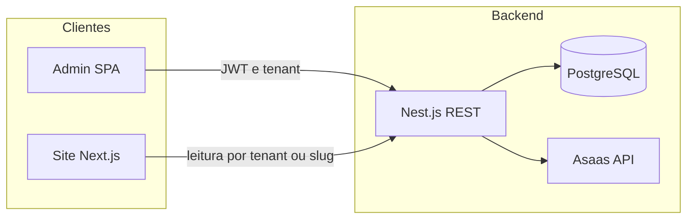

# Arquitetura — Church Manager (SaaS multitenant)

Documento canónico da visão técnica alvo. O monorepo existe por **co-localização** e conveniência de desenvolvimento; cada aplicação mantém **o seu próprio** `package.json` e pipeline de build, **sem** pacotes partilhados (ex.: sem `@shared/types`).

### Site público e repositórios

O **painel admin** e a **API** são o núcleo versionado neste monorepo. O **site público Next.js** de cada igreja é, em geral, um **projecto à parte** (repositório separado), porque ao comercializar o CMS cada cliente pode ter tema, deploy e alterações próprias sem estar acoplado ao histórico do produto. O vínculo é sempre **REST + OpenAPI** (URL da API configurável por ambiente). Uma pasta opcional `apps/site-public` pode existir só como **starter** ou referência interna — ver [ADR 0002](./adr/0002-site-public-repository-strategy.md).

## 1. Visão geral

| Camada | Tecnologia | Responsabilidade |
|--------|------------|------------------|
| API | Nest.js, REST, PostgreSQL | Única porta de entrada de dados, regras de negócio, integrações (Asaas), multitenancy |
| Painel admin | React 19, Vite, TypeScript, Tailwind, Shadcn | UI/UX, estado local, chamadas HTTP à API (ex.: Axios); **sem** segredos de terceiros |
| Site público | Next.js, TypeScript, Tailwind | SSR/SSG, leitura da API (e rotas públicas acordadas); **sem** chaves Asaas |

O backend segue organização **modular** e inspiração **hexagonal (ports & adapters)**: o núcleo de domínio não depende de detalhes de HTTP ou de SDKs externos; integrações (ex.: Asaas) ficam em **adapters** atrás de interfaces explícitas.

## 2. Multitenancy (regra transversal)

- Cada igreja é um **tenant** identificado por `tenant_id`.
- O JWT (ou mecanismo de sessão acordado) deve permitir ao Nest.js resolver **de forma segura** o `tenant_id` do utilizador autenticado.
- **Toda** leitura/escrita em dados de negócio deve ser **filtrada** por `tenant_id` no serviço/repositório (não confiar apenas no cliente).
- O site público obtém dados **apenas** de endpoints que fixam o tenant por **slug**, **token público limitado** ou outro mecanismo explícito documentado — nunca listar dados de todos os tenants.

### 2.1 CORS (browser)

- **`/api/public/tenants/:slug/...`:** o cabeçalho `Origin` só é reflectido em `Access-Control-Allow-Origin` se existir correspondência na tabela **`tenant_public_web_origins`** dessa igreja (cadastro por tenant na base de dados). Assim, cada cliente comercial pode ter um ou mais domínios do site público sem listar todos os sites do mundo no `.env`.
- **`/api/auth`**, **`/api/admin/...`** e **`/api/health`:** continuam a usar **`ADMIN_CORS_ORIGIN`** (lista separada por vírgula), típica do deploy do painel admin (ex.: `http://localhost:5173`).
- Implementação: `DynamicCorsMiddleware` (Nest) com cache curto por `slug`; a biblioteca `cors` estática não basta porque o `Origin` permitido depende do caminho e do tenant. No Express/Nest, o **prefixo global `api` não se aplica ao middleware** — o caminho visto é tipicamente `/public/tenants/...` e `/auth/login`, não `/api/...`; o código aceita ambas as formas.

## 3. Módulos de negócio (domínios)

### 3.1 Core — Auth e tenants

- CRUD de tenants (igrejas) e gestão de utilizadores administrativos **ligados** a um `tenant_id`.
- Guards/middlewares Nest.js: extrair `tenant_id` do contexto autenticado e disponibilizá-lo à camada de aplicação.

### 3.2 Eventos

- Agenda: CRUD com `tenant_id` obrigatório em todas as operações persistidas.

### 3.3 CMS (conteúdo do site)

- Secções/blocos por tenant, com `content` em **JSONB** no PostgreSQL para flexibilidade de layout no Next.js sem alterar o esquema relacional a cada mudança de UI.
- Índice único lógico recomendado: `(tenant_id, section_key)`.

### 3.4 Financeiro e assinaturas (Asaas)

- Tabelas: `financial_plans`, `financial_subscriptions`, `financial_transactions` (detalhe em [financial-schema-and-webhooks.md](./financial-schema-and-webhooks.md)).
- **Regra:** o frontend só solicita **intenção** de pagamento à API; chaves `ASAAS_*` existem **apenas** no backend.
- Webhook Asaas: endpoint dedicado, validação de assinatura, **idempotência** e transações — ver documento financeiro.

## 4. Contratos HTTP e tipagem (sem pacotes partilhados)

- **Backend:** DTOs (classes) e documentação **OpenAPI/Swagger** gerada pelo Nest.js.
- **Admin e Site:** interfaces TypeScript **locais** alinhadas às respostas documentadas; não usar `any`; opcionalmente gerar cliente a partir do OpenAPI **dentro** de cada app (sem pacote monorepo partilhado).

Fluxo recomendado para o admin: camada de API + **TanStack Query** + hooks (ex.: `useSubscription`) separados dos componentes visuais.

## 5. Modelo de dados relacional (base editorial)

As tabelas editoriais mantêm o espírito do modelo inicial (PostgreSQL), adaptado a uma API Nest **própria** (sem `auth.users` do Supabase — utilizadores são modelados na nossa base, com campos de credencial conforme a estratégia de auth escolhida).

| Tabela | Notas principais |
|--------|------------------|
| `tenants` | `id` (PK), `name`, `slug` único |
| `users` | `id` (PK), `tenant_id` FK NOT NULL, `role`, credenciais conforme design |
| `events` | `tenant_id` FK, `title`, `date` (timestamptz), `description`, `banner_url`, `is_active` |
| `site_sections` | `tenant_id` FK, `section_key`, `content` JSONB; UNIQUE `(tenant_id, section_key)` |

Armazenamento de ficheiros (banners): URL externa ou serviço de object storage integrado via backend — a definir na implementação.

## 6. Riscos e mitigações (actualizados)

| Risco | Mitigação |
|-------|-----------|
| Vazamento entre tenants | Filtro obrigatório por `tenant_id` no código server-side; revisão de código em PRs; testes de isolamento |
| Custo/latência no site público | Cache Next.js, ISR/revalidação conforme necessidade |
| CMS rígido | JSONB em `site_sections.content` |

## 7. Decisões arquitectónicas (ADRs)

- [ADR 0001: De Supabase/PostgREST para API Nest.js](./adr/0001-from-supabase-to-nest-api.md)
- [ADR 0002: Estratégia do repositório do site público](./adr/0002-site-public-repository-strategy.md)

## 8. Roadmap por fases

1. **Fundação** — Estrutura de monorepo (API + admin; site opcional); Nest.js + PostgreSQL; migrações base (`tenants`, `users`); módulo Core; JWT/guards e `tenant_id` no contexto; Swagger ativo.
2. **Domínio editorial** — Módulos Eventos e CMS; painel admin mínimo; endpoints públicos **read-only** para consumidores Next.js (por `slug` / tenant explícito), em repos separados ou starter interno.
3. **Financeiro** — Adapter Asaas; tabelas `financial_*`; `POST` de subscrição/intenção de pagamento; `POST` webhook com idempotência e testes de concorrência.
4. **Endurecimento** — Rate limiting no webhook; observabilidade (logs/métricas); auditoria de segurança multitenant.

---

*Documento vivo: ajustar com ADRs futuros (ORM, detalhes de auth, storage).*
